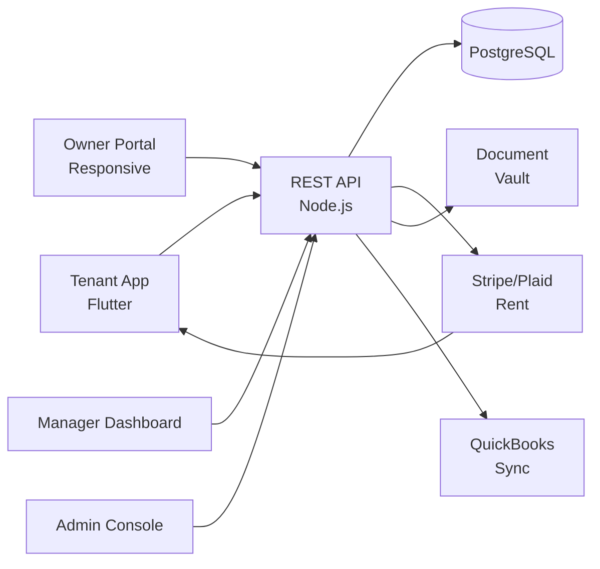

# Buildium Clone — White-Label Property Management SaaS Platform by Miracuves

**MXBuildium** is a production-ready, white-label Buildium clone: a complete property-management SaaS with tenant, owner, and manager dashboards — delivered with **100% source code ownership** in **6 working days**.

> 🏢 **See it running before you talk to anyone.** Live tenant app, landlord dashboard, and admin console — demo credentials are printed on the [solution page](https://miracuves.com/buildium-clone#demo). No sales call required.

---

## 🚀 Live Demos

| Environment | URL | What you can test |
|---|---|---|
| 📱 Tenant App | [mas.mimeld.com](https://mas.mimeld.com) | Pay rent, request maintenance, view lease |
| 🌐 Owner Portal | [mxbuildium.mimeld.com](https://mxbuildium.mimeld.com) | Full owner/landlord experience in browser |
| 🛠️ Manager Dashboard | [Solution page → Demo](https://miracuves.com/buildium-clone#demo) | Properties, tenants, maintenance, accounting |
| 🛠️ Admin Console | [Solution page → Demo](https://miracuves.com/buildium-clone#demo) | Users, properties, plans, analytics |

Demo credentials for all environments: **[miracuves.com/buildium-clone → Demo section](https://miracuves.com/buildium-clone/#demo)**

---

## ✨ What Makes This Buildium Clone Different

Most property-mgmt scripts stop at "list a unit." This platform ships with the features that actually run a property-mgmt *business*:

- **Online Rent + Late Fees** — ACH/debit/credit, auto-late-fee, partial payments, ledgers — what replaces rent-collection chaos
- **Maintenance Ticketing** — photos + videos + vendor routing + status, with permission controls — what tenants actually value
- **Owner Statements** — monthly owner statements with auto-reconciliation, expense categorization, tax-ready PDFs
- **Multi-Property Accounting** — trust accounting, owner ledgers, vendor invoices, 1099 — what scale-up needs
- **Tenant Screening** — credit, background, eviction — same tools Buildium and AppFolio charge up to $50/screening for

## 📦 Core Features

**Tenant:** pay rent · lease docs · maintenance requests · messaging · community · multi-unit support

**Manager/Owner:** property listing · tenant screening · lease management · maintenance · accounting · reporting

**Admin:** user management · plans · integrations · analytics · compliance reports

## 🏗️ Architecture

**Stack:** Flutter mobile apps · Node.js or .NET backend · PostgreSQL · Stripe + Plaid · QuickBooks Online integration · Stripe, Plaid for ACH, regional gateways

## 📋 What’s Included

- ✅ Full source code — backend, web, mobile apps, panels (no encryption, no license locks)
- ✅ Deployment to your servers & app store submission assistance
- ✅ Your branding — white-label rename, logo, colors, domain
- ✅ 60 days post-launch support + 12 months of free updates
- ✅ Documentation & handover

**Pricing:** from **$12,999**, transparent on the [solution page](https://miracuves.com/buildium-clone/#pricing) — no "contact us for quote" games.

## 🆚 Why Not Build From Scratch?

Custom property-mgmt platforms run $80k–$300k and 4–9 months. A proven white-label base gets you to market in 6 working days for a fraction of that, with your budget reserved for integrations and growth marketing.

## 📚 Resources

- 📖 [Buildium Clone — Full Solution Page](https://miracuves.com/buildium-clone) (features, pricing, demos, FAQ)
- 💰 [How Much Does a Property Management App Cost in 2026?](https://miracuves.com/buildium-clone#pricing) pricing breakdown & what's included
- 📝 [Best Buildium Clone Script in 2026](https://miracuves.com/buildium-clone/blog/) features, pricing & launch guide
- 🧠 [Online Rent Collection: Statics & Trust Accounting](https://miracuves.com/buildium-clone/blog/) ACH, ledger, late fees
- ✅ [Miracuves Facts & Claims Ledger](https://miracuves.com/buildium-clone/facts/) every claim we make, verified

## 🏢 About Miracuves

[Miracuves Solutions](https://miracuves.com) builds white-label clone apps and custom software from Mumbai, India — 90+ ready-made solutions, live demos for every product, transparent pricing, and delivery in 6 working days. Operating since 2010.

**Talk to us:** [WhatsApp](https://wa.me/919830009649) · [Schedule a consultation](https://miracuves.com/schedule-consultation/) · [miracuves.com](https://miracuves.com)

---

### ⚠️ Note on This Repository

This repository is a product overview. The full source code is delivered to clients on purchase — see [what’s included](https://miracuves.com/buildium-clone/#included). For a hands-on evaluation, use the live demos above; credentials are public on the solution page.

*Keywords: buildium clone, buildium clone script, property management, rental property, white label Buildium, owner portal, tenant app, Flutter property, Node.js SaaS*

---

<!--
══════════════════════════════════════════════════
TEMPLATE VARIABLE KEY — auto-generated from Netflix-Clone pattern
══════════════════════════════════════════════════
{APP_NAME}        Buildium Clone
{MX_NAME}         MXBuildium
{CATEGORY}        Property Management SaaS Platform
{DEMO_WEB}        mxbuildium.mimeld.com
{PRICE}           $12,999
{SLUG}            buildium-clone
{SOLUTION_URL}    https://miracuves.com/buildium-clone/
{VERTICAL}        property_mgmt

See /tmp/verticals/property_mgmt.txt for the vertical config used to generate this README.
══════════════════════════════════════════════════
-->