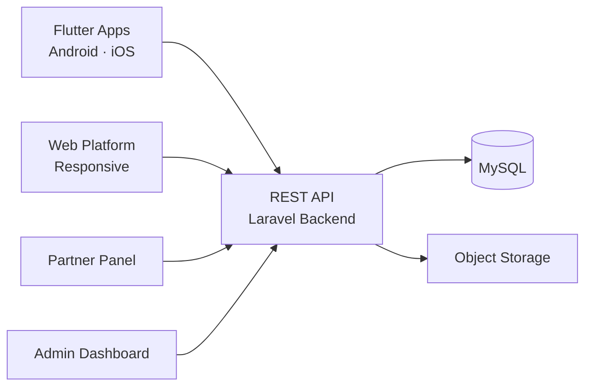

# Buildium Clone — White-Label Solution by Miracuves

---

## Table of Contents

1. [Who Is This For?](#who-is-this-for)
2. [How It Works](#how-it-works)
3. [Core Features](#core-features)
4. [Architecture](#architecture)
5. [Revenue Streams](#revenue-streams)
6. [What's Included](#whats-included)
7. [Deployment Timeline](#deployment-timeline)
8. [Why Not Build From Scratch?](#why-not-build-from-scratch)
9. [Market Opportunity](#market-opportunity)
10. [Client Testimonials](#client-testimonials)
11. [FAQ](#faq)
12. [Resources](#resources)
13. [About Miracuves](#about-miracuves)

## Live Demos

| Environment | URL | What you can test |
|---|---|---|
| Web Platform | [mbuildium.mimeld.com](https://mbuildium.mimeld.com) | Full experience in the browser |
| Mobile App (Android) | [mas.mimeld.com](https://mas.mimeld.com) | Browse, transact, engage |
| Admin Dashboard | [Solution page → Demo](https://miracuves.com/buildium-clone/#demo) | Users, content, plans, analytics |

Demo credentials: [miracuves.com/buildium-clone -> Demo section](https://miracuves.com/buildium-clone/#demo)

## What Makes This Buildium Clone Different

<!-- TODO: fill 3-5 vertical-specific differentiators -->

## Who Is This For?

| Buyer Type | Use Case |
|---|---|
| Property Managers | Digitize operations with tenant and owner portals |
| Real Estate Firms | Manage multi-property portfolios from one dashboard |
| SaaS Startups | Build a property management SaaS for the real estate market |
| Agencies / Resellers | White-label and deliver to property management companies |

---

## How It Works

1. Property manager onboards properties and sets up lease agreements
2. Tenant logs into portal to pay rent, submit maintenance requests, and view documents
3. Maintenance requests are routed to assigned vendors with SLAs
4. Rent collection is automated with late fee rules and receipts
5. Owner portal provides real-time financial reports and occupancy data
6. Admin dashboard tracks portfolio-wide performance and vacancy rates

---

## Core Features

### Tenant Portal
- Online rent payment with auto-pay setup
- Submit and track maintenance requests with photo uploads
- View lease documents, receipts, and notices
- Update personal information and emergency contacts
- Message property manager directly
- Review payment history and download tax documents

### Owner Portal
- Real-time financial reports and occupancy data
- View property performance and comparables
- Approve maintenance requests over a set threshold
- Owner fund disbursement and statements
- Property listing management and vacancy alerts

### Property Manager Dashboard
- Multi-property portfolio overview with KPIs
- Rent collection dashboard with late fee automation
- Maintenance workflow (request, assign, approve, complete)
- Accounting module with ledger, invoices, and 1099s
- Vendor management and procurement
- Lease management (creation, renewal, termination)

### Admin Panel
- Company-wide property portfolio management
- User roles and permission configuration
- Fee structure and pricing plan management
- System-wide reporting and business analytics

---

## Advanced Features

The platform integrates AI-powered features that reduce manual overhead and capture revenue opportunities:

- **AI Rent Optimization** - Recommends optimal rent prices based on market comparables and occupancy
- **AI Maintenance Prioritization** - Automatically prioritizes maintenance requests based on urgency and tenant history
- **AI Late Payment Prediction** - Flags tenants at risk of late payment for proactive outreach

---

## Apps and Web Panels

| Module | Description |
|---|---|
| Tenant Portal (Web + Mobile) | Pay rent, maintenance, documents, messages |
| Owner Portal (Web) | Financials, reports, approvals, disbursements |
| Property Manager Dashboard (Web) | Properties, tenants, maintenance, accounting |
| Admin Web Panel | Portfolio, users, billing, analytics |

---

## Architecture

**Stack:**

| Layer | Technology |
|---|---|
| Mobile Apps | Flutter (iOS + Android, single codebase) |
| Web Platform | React.js responsive web app |
| Backend API | Node.js + Express |
| Database | MongoDB |
| Payments | Stripe, Razorpay, ACH integration |
| Notifications | Email, SMS, Firebase Cloud Messaging |
| Cloud Hosting | AWS / DigitalOcean / Contabo VPS |

---

## Revenue Streams

The platform is engineered to generate revenue from day one through multiple complementary channels:

- **Monthly subscription** - SaaS fee per unit or per property
- **Transaction fees** - percentage of rent collected through the platform
- **Maintenance fees** - vendor referral or dispatch fee
- **Premium features** - advanced reporting, AI analytics, API access

---

## Security and Compliance

- OTP-based authentication
- SSL/TLS encrypted API communication
- GDPR-ready data handling

---

## What's Included

| Plan | Price | What You Get |
|---|---|---|
| Standard | **$6,699** | Complete source code, all apps, admin panel, rebranding, 1 year updates |
| Enterprise | Custom Quote | Everything in Standard + custom features, multi-region, priority support |

**What is included:**

- Tenant Portal (Web + Mobile)
- Owner Portal (Web)
- Property Manager Dashboard (Web)
- Admin Web Panel
- Full Source Code
- Complete Rebranding (your logo, colors, app name)
- Server Deployment
- App Store and Google Play Submission Support
- 60 Days Free Bug Support
- Free 1-Year Updates

---
**Pricing:** from **$12,999** — transparent on the [solution page](https://miracuves.com/buildium-clone/#pricing).

## Deployment Timeline

| Day | Milestone |
|---|---|
| Day 1 | Server setup, environment configuration, initial deployment |
| Day 2 | White-labeling - app name, logo, colors, splash screens |
| Day 3 | Payment gateway integration + third-party API configuration |
| Day 4 | Custom feature implementation (if applicable) |
| Day 5 | QA, testing, bug fixes across all panels |
| Day 6 | App Store + Google Play submission + Go-live |

> **Average go-live: 6 business days from payment confirmation.**

---

## Why Not Build From Scratch?

| Factor | Build from Scratch | Miracuves Solution |
|---|---|---|
| Time to Launch | 6-12 months | 6 days |
| Development Cost | $60,000-$150,000 | From $6,699 |
| Source Code Ownership | Yes | Yes |
| Customization | Full | Full |
| Post-Launch Support | Depends on team | 60 days included |
| Risk | High | Low |

---

## Market Opportunity

| Metric | Data |
|---|---|
| Global PropTech Market (2024) | $32 billion |
| Projected Market Size (2030) | $86 billion |
| CAGR | ~16% |
| Key Adoption Markets | USA, UK, Canada, Australia, UAE |
| Average Properties per Manager | 50-200 |

> Source: Statista, Grand View Research, Allied Market Research

---

## Successful Verticals

- Residential property management (single-family, multi-family)
- Commercial real estate management
- HOA and community association management
- Student housing and co-living management

---

## Client Testimonials

> *"We migrated 5,000 units to the platform in two weeks. The tenant portal alone reduced our call volume by 60 percent."*
> - Operations Director, Property Management

---

## FAQ

**How much does a Buildium clone cost?**
A white-label Buildium clone from Miracuves starts at $6,699 with complete source code ownership.

**Is it web-only or mobile?**
Both. Tenants have a mobile app, while managers and owners use the web dashboard.

**Does it support ACH payments?**
Yes. ACH, credit card, and digital wallet payments are supported.

**Can I customize the fee structure?**
Yes. Subscription tiers, transaction fees, and add-on pricing are configurable.

**Do I get the source code?**
Yes. Complete source code ownership is included.

**How long does it take to launch?**
6 business days from payment confirmation.

---

## Related Solutions

Explore our other white-label clone solutions:

- [Blueground Clone - Corporate Housing](https://github.com/Miracuves-Solutions/Blueground-Clone)
- [AppFolio Clone - Property Mgmt](https://github.com/Miracuves-Solutions/AppFolio-Clone)
- [Airbnb Clone - Vacation Rentals](https://github.com/Miracuves-Solutions/Airbnb-Clone)

---

## Resources

- [Full Solution Page](https://miracuves.com/buildium-clone/) — features, pricing, demos, FAQ

## Get Started

**Ready to launch your property management SaaS?**

| Channel | Link |
|---|---|
| Full Solution Page | [miracuves.com/buildium-clone](https://miracuves.com/buildium-clone/) |
| Email | info@miracuves.com |
| WhatsApp | [+91 98300 09649](https://wa.me/919830009649) |
| Book a Call | [Free Consultation](https://miracuves.com/contact/) |

---

## About Miracuves

**Miracuves Solutions Pvt. Ltd.** is a Mumbai-based software company specializing in white-label clone app solutions across 12+ industries.

- 90+ ready-to-deploy solutions
- 6-day delivery guarantee
- 60+ engineers on staff
- 3,900+ apps delivered
- Full source code ownership
- Clients across 40+ countries including India and USA

[Explore all 90+ solutions at miracuves.com](https://miracuves.com)

---

## Disclaimer

This product is independently developed by Miracuves. All product names, logos, and brands are property of their respective owners. Use of these names does not imply endorsement.

---

*(c) 2026 Miracuves Solutions Pvt. Ltd. | Mumbai, India*
*This repository contains product documentation only - no proprietary source code is published here.*

*Keywords: buildium clone, buildium script, white label solution, laravel flutter app, clone script*

---

### Note on This Repository

This repository is a product overview. The full source code is delivered to clients on purchase. For a hands-on evaluation, use the live demos above; credentials are public on the solution page.

<!--
=========================================================
GENERATED FROM MIRACUVES NETFLIX-CLONE README TEMPLATE
Canon: 6 working days, from $2,799 floor, 60 days support + 12 months updates.
Never use 3 days. See https://miracuves.com/facts/ for audited claims.
=========================================================
-->
